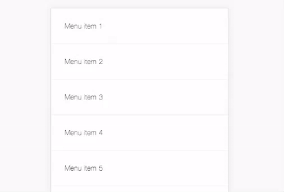

# Reveal menu UI
A performant swipeable list slide menu reveal that works on any framework just like apple mail or Gmail. +1 for simplicity.
The key is that is that performance is gained because most task are delegated to css and the composite layer at it's most transition calculations are made to work on the composite layer



## Installation
<strong>For a demo, after starting the project with npm start. Just open the index.html and debug in mobile view to get touch events.</strong>
```
npm start
```

## Usage
Check the HTML and CSS and it will all become clear to you. Basically they are two menus in the same div. One is ontop and the other is at the bottom.
(important!) Keep in mind that it is only listening to touch events, so mouse events will not work. This is by design.

Include the script and create a new instance by
```
var swiper = new SwipeableList({
  element: '.swipeable-list', // Element on page to select
  threshold: 50 // the amount of threshold the menu needs to open. The lower the number the easier the menu will open
});
```

## Contributing
1. Fork it!
2. Create your feature branch: `git checkout -b my-new-feature`
3. Commit your changes: `git commit -am 'Add some feature'`
4. Push to the branch: `git push origin my-new-feature`
5. Submit a pull request :D
